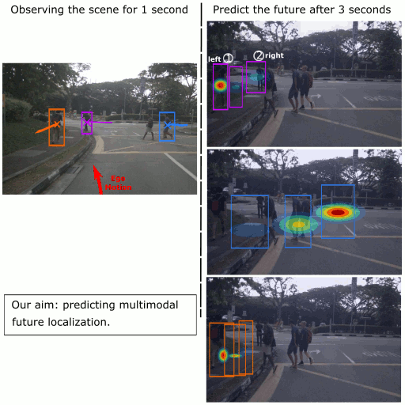

This repository corresponds to the official source code of the CVPR 2020 paper:

<a href="https://arxiv.org/abs/2006.04700">Multimodal Future Localization and Emergence Prediction for Objects in Egocentric View with a Reachability Prior</a>

To get an overview about the method and its results, we highly recommend checking our videos at <a href="https://lmb.informatik.uni-freiburg.de/Publications/2020/MCBB20/">[Page]</a>




#### Requirements

- Tensorflow 1.14.
- opencv-python, sklearn, matplotlib (via pip).

#### Data

To get the post-processed testing datasets used in our paper, you can download them from <a href="https://lmb.informatik.uni-freiburg.de/resources/software.php">[resources page]</a>. There navigate to FLN-EPN-RPN and download both FIT and nuScenes [1]. For Waymo dataset [2], you have to do the following steps to get the data: (1) go to www.waymo.com/open and click on 'Access Waymo Open Dataset' to sign with your google account and accept the terms from Waymo, (2) after logging you can go to <a href="https://console.cloud.google.com/storage/browser/waymo_open_dataset_test_fln">[link]</a> to download the dataset. Please note that you may need to wait up to 24h after step 1 to be granted access.

After extracting these datasets, you should have the following structure:
```
FLN-EPN-RPN
└── datasets
    └── FIT
    └── nuScenes
    └── waymo
```

FLN-EPN-RPN\datasets

FLN-EPN-RPN\datasets\FIT

FLN-EPN-RPN\datasets\waymo

FLN-EPN-RPN\datasets\nuScenes

Inside each dataset, there are a set of folders representing the testing scenes. For each scene you have the following structure:

- imgs: contains the images of the scene.
- semantics: for each image, we provide its semantics segmentation (obtained from deeplabV3) and its static semantic segmentation (after inpainting all dynamic objects).
- ego: for each image, the ego is stored as vector of 7 components (4 for rotation quaternions and 3 for translation). To inspect the .float3 file, we provide a function readFloat() in utils_np.py.
- floats: for each image, we store .float3 and -label.float3 files. The former is a numpy array of shape (2500,6) which can store up to 2500 annotated objects. Each object has 6 components describing its bounding box (tl_x, tl_y, w, h, score, class_id). The indexes of the objects represent the tracking id and are given in the file -label.float3.
- floats_epn: (only for nuScenes) same structure as the files in floats.
- scene.txt: each line represent one testing sequence and has the following format: tracking_id img_0,img_1,img_2,img_future.
- scene_epn.txt: each line represent one testing sequence and has the following format: tracking_id img_0 img_future. Note here that img_0 is the image where the object is not visible and img_future is the image where the object emerges.

#### Models

We also provide the trained models for both our Future Localization Network (FLN) and Emergence Prediction Network (EPN) at <a href="https://lmb.informatik.uni-freiburg.de/resources/software.php">[resources page]</a>, after extracting them, you should have the following structure:
```
FLN-EPN-RPN
└── models
    └── EPN
    └── EPN-no-RPN
    └── FLN
    └── FLN-no-RPN
```

#### Testing

To test FLN, you can run:

python test_fln.py --dataset=DATASET --output

- DATASET has one of the following values: FIT, nuScenes, waymo
- --output: will write the output files to the disk under the path specified in the config.py (OUTPUT_FOLDER_FLN). If you need only to get the testing accuracies without writing files (much faster), you can simply remove the --output.

If you want to test FLN without RPN, then you need to add --noRPN.

To test EPN, you can run:

python test_epn.py --output

Currently we provide testing EPN for only nuScenes. Extending to other datasets is a future work.


#### Citation

If you use our repository or find it useful in your research, please cite the following paper:


<pre class='bibtex'>
@InProceedings{MCBB20,
  author       = "O. Makansi and {\"O}. {\c{C}}i{\c{c}}ek and K. Buchicchio and T. Brox",
  title        = "Multimodal Future Localization and Emergence Prediction for Objects in Egocentric View with a Reachability Prior",
  booktitle    = "IEEE International Conference on Computer Vision and Pattern Recognition (CVPR)",
  pages        = "4354-4363",
  month        = " ",
  year         = "2020",
  keywords     = "future prediction, multimodal distribution learning, future localization, egocentric view, context-awareness, trajectory forecasting, autonomous driving, uncertainty estimation, autonomous systems, multihypotheses learning",
  url          = "http://lmb.informatik.uni-freiburg.de/Publications/2020/MCBB20"
}
</pre>

#### References

[1] Holger Caesar, Varun Bankiti, Alex H. Lang, Sourabh Vora, Venice Erin Liong, Qiang Xu, Anush Krishnan, Yu Pan, Giancarlo Baldan, and Oscar Beijbom. nuscenes: A multimodal dataset for autonomous driving. arXiv preprint arXiv:1903.11027, 2019.

[2] Pei Sun, Henrik Kretzschmar, Xerxes Dotiwalla, Aurelien Chouard, Vijaysai Patnaik, Paul Tsui, James Guo, Yin Zhou, Yuning Chai, Benjamin Caine, Vijay Vasudevan, Wei Han, Jiquan Ngiam, Hang Zhao, Aleksei Timofeev, Scott Ettinger, Maxim Krivokon, Amy Gao, Aditya Joshi, Yu Zhang, Jonathon Shlens, Zhifeng Chen, and Dragomir Anguelov. Scalability in perception for autonomous driving: Waymo open dataset, 2019.

#### License


This source code is shared under the license CC-BY-NC-SA, please refer to the LICENSE file for more information.

This source code is only shared for R&D or evaluation of this model on user database.

Any commercial utilization is strictly forbidden.

For any utilization with a commercial goal, please contact [contact_cs](mailto:contact_cs@imra-europe.com) or [bendahan](mailto:bendahan@imra-europe.com)
